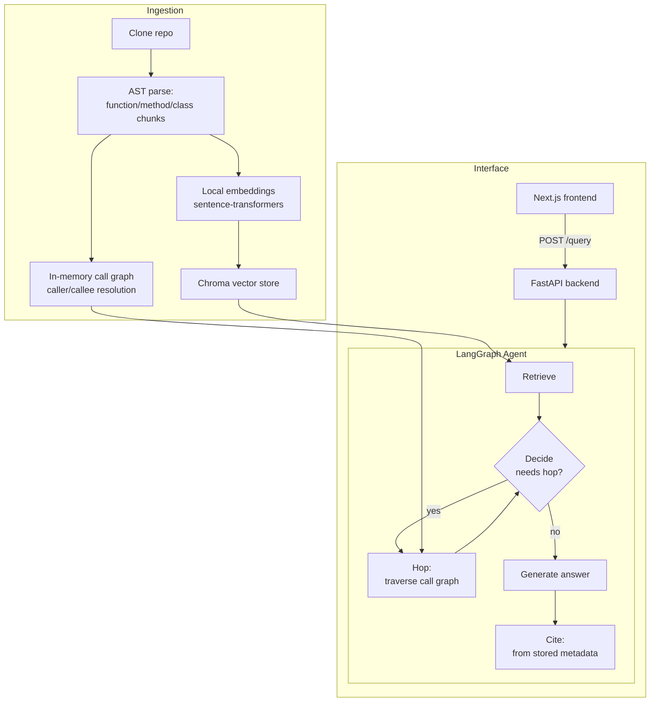

# Mars — Multi-hop Agent Retrieval and Scoring

A codebase-aware coding agent that answers questions about a Python repository using semantic retrieval combined with AST-derived call-graph traversal — not just similarity search over text chunks.

**Live demo:** [PLACEHOLDER — Vercel URL once deployed]
**API:** [PLACEHOLDER — Render URL once deployed]

## What it does

Ask a question like *"what calls the `update` method?"* and Mars:

1. Parses the target repository's Python source using AST, chunking it at function/method/class granularity.
2. Embeds each chunk locally (`sentence-transformers`) and stores it in a Chroma vector store.
3. Retrieves semantically relevant chunks for your question.
4. Decides — via an LLM call — whether the retrieved context is sufficient, or whether tracing the code's call graph (callers/callees, up to 3 hops) would answer more completely.
5. Generates an answer grounded only in retrieved context, with citations built directly from stored metadata (never hallucinated).

Currently supports: `tqdm`, `requests`, `flask`, `httpx`.

## Architecture



## Stack

- **Backend:** FastAPI, LangGraph, LangChain, Groq (`openai/gpt-oss-20b`)
- **Retrieval:** ChromaDB, `sentence-transformers` (`all-MiniLM-L6-v2`)
- **Frontend:** Next.js (App Router), TypeScript, Tailwind CSS v4
- **Deploy:** Render (backend), Vercel (frontend) — both free tier

Built entirely on free-tier infrastructure — no paid APIs or hosting.

## Design decisions worth noting

- **Function/method-level chunking** via Python's `ast` module, not naive text splitting — preserves semantic boundaries and enables accurate line-range citations.
- **Static call-graph resolution** handles `self.x`/`cls.x` method calls and unambiguous same-name function calls; deliberately does *not* guess on ambiguous or dynamically-dispatched calls, trading recall for precision.
- **Citations are never LLM-generated** — they're built directly from parsed chunk metadata, so they can't hallucinate line numbers or function names.
- **Hop limit of 3** prevents unbounded graph traversal; the decide-node re-evaluates after each hop rather than committing to a fixed number upfront.

## Known limitations

- **Python-only ingestion** - Mars currently parses source via Python's `ast` module, so only Python codebases can be ingested. Non-Python repos (JS/TS, etc.) will fail ingestion with a clear error rather than silently producing an empty, non-functional agent. Multi-language support (via `tree-sitter`, which ships pre-compiled wheels for Python/JS/TS with no native build step) is a planned extension — see roadmap.

- **Groq-Free Tier Constraint** - The app is currently lossy by design because dense codebases require high number of tokens which is not delivered by the groq free tier limitation. Might improve to paid tier later if need to turn this into a product. Feel like this is sufficient for a portfolio project.

## Local setup

```bash
git clone https://github.com/sanandobanerjee/Mars-AI.git
cd Mars-AI

python -m venv .venv
.venv\Scripts\activate
pip install -r requirements.txt
cp .env.example .env  # add your GROQ_API_KEY

python -m scripts.ingest tqdm
python -m scripts.ingest requests
python -m scripts.ingest flask
python -m scripts.ingest httpx

python -m uvicorn src.api.main:app --reload --port 8000
```

In a separate terminal:

```bash
cd mars-frontend
npm install
npm run dev
```

Open `http://localhost:3000`.

## Roadmap (v2)

- Multi-language ingestion (tree-sitter-based parsing for JS/TS), with graceful degradation to retrieval-only (no call-graph hop) for languages without a resolver yet
- RAGAS-based evaluation suite: faithfulness, context precision/recall, and a custom citation-accuracy metric
- Hallucination guardrail node with before/after comparison
- Hand-curated eval dataset across all four target repos