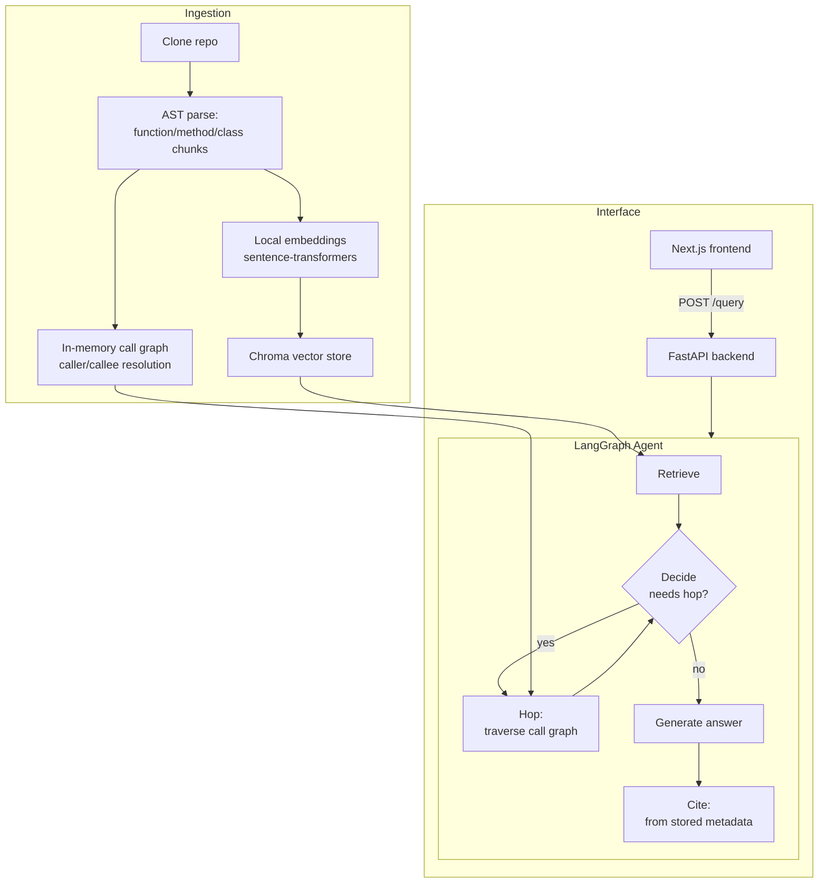

# Mars — Multi-hop Agent Retrieval and Scoring

A codebase-aware coding agent that answers questions about a Python repository using semantic retrieval combined with AST-derived call-graph traversal — not just similarity search over text chunks.

Most RAG demos stop at "find similar text and summarize it." Mars adds a second reasoning layer: when a question depends on how code is actually *connected* — not just what a docstring says — the agent traces the codebase's real call graph to pull in the right context before answering. This project exists to demonstrate that distinction concretely, backed by a 32-question evaluation suite rather than anecdote (see [Evaluation](#evaluation)).

## What it does

Ask a question like *"what calls the `update` method?"* and Mars:

1. Parses the target repository's Python source using AST, chunking it at function/method/class granularity.
2. Embeds each chunk locally (`sentence-transformers`) and stores it in a Chroma vector store.
3. Retrieves semantically relevant chunks for your question.
4. Decides — via an LLM call — whether the retrieved context is sufficient, or whether tracing the code's call graph (callers/callees, up to 3 hops) would answer more completely.
5. Generates an answer grounded only in retrieved context, with citations built directly from stored metadata (never hallucinated).

Currently supports any public Python GitHub repository, ingested on demand, with four repos (`tqdm`, `requests`, `flask`, `httpx`) pre-indexed and covered by the evaluation suite below.

## Architecture



## Stack

- **Backend:** FastAPI, LangGraph, LangChain, Groq (`openai/gpt-oss-20b`)
- **Retrieval:** ChromaDB, `sentence-transformers` (`all-MiniLM-L6-v2`)
- **Frontend:** Next.js (App Router), TypeScript, Tailwind CSS v4
- **Deploy:** Currently runs locally (see [Local setup](#local-setup)); cloud deployment (AWS EC2) is in progress — see [Roadmap](#roadmap)

Built entirely on free-tier infrastructure — no paid APIs.

## Design decisions worth noting

- **Function/method-level chunking** via Python's `ast` module, not naive text splitting — preserves semantic boundaries and enables accurate line-range citations.
- **Static call-graph resolution** handles `self.x`/`cls.x` method calls and unambiguous same-name function calls; deliberately does *not* guess on ambiguous or dynamically-dispatched calls, trading recall for precision.
- **Citations are never LLM-generated** — they're built directly from parsed chunk metadata, so they can't hallucinate line numbers or function names.
- **Hop limit of 3** prevents unbounded graph traversal; the decide-node re-evaluates after each hop rather than committing to a fixed number upfront.
- **Evaluation uses a custom single-call LLM-as-judge, not RAGAS.** RAGAS's standard metrics issue multiple judge calls per question (claim decomposition, per-claim verification); on Groq's free tier this repeatedly triggered rate limits during testing. A single consolidated judge call per question, scoring faithfulness, correctness, and (for adversarial questions) fabrication avoidance, was a deliberate trade of framework-standard tooling for one that fits the project's zero-cost constraint.

## Evaluation

Mars is evaluated against a hand-curated, 32-question set (12 single-hop, 12 multi-hop, 8 adversarial) spanning four structurally different codebases (`tqdm`'s flat utility functions, `requests`' session/mixin design, `flask`'s layered class hierarchy, `httpx`'s sync/async duality). Each answer is scored by an LLM judge for faithfulness and correctness, with citation accuracy checked programmatically against ground-truth function names — not judged, to avoid asking an LLM to eyeball something a set comparison does reliably.

**Latest results:** multi-hop questions correctly trigger call-graph traversal 75% of the time (`hop_trigger_rate`), the agent correctly declines to fabricate an answer for questions about nonexistent functionality 87.5% of the time, and citation precision — after a documented correction round (below) — sits at 0.667 (single-hop) and 0.736 (multi-hop).

| Run date | Single-hop faithfulness | Single-hop correctness | Single-hop citation precision | Multi-hop faithfulness | Multi-hop correctness | Multi-hop citation precision | Multi-hop hop trigger rate | Adversarial faithfulness | Adversarial correctness | Adversarial fabrication avoidance |
| --- | ---: | ---: | ---: | ---: | ---: | ---: | ---: | ---: | ---: | ---: |
| 2026-09-20 | 0.825 | 0.792 | 0.542 | 0.900 | 0.867 | 0.528 | 0.750 | 0.750 | 0.812 | 0.875 |
| 2026-09-21 | 0.783 | 0.783 | 0.500 | 0.904 | 0.871 | 0.528 | 0.750 | 0.875 | 0.938 | 0.875 |
| 2026-09-23 | 0.775 | 0.783 | 0.667 | 0.904 | 0.871 | 0.736 | 0.750 | 0.875 | 0.938 | 0.875 |

Full run data: [eval/results/summary-20260920-154606.json](eval/results/summary-20260920-154606.json), [eval/results/summary-20260921-112044.json](eval/results/summary-20260921-112044.json), [eval/results/summary-20260923-151607.json](eval/results/summary-20260923-151607.json)

**What the evaluation process surfaced.** Faithfulness and correctness stayed stable across all three runs (0.78–0.90 range); citation precision, in contrast, rose sharply between runs — because it wasn't the agent that improved, it was the dataset. Reading actual agent output against hand-drafted expected citations surfaced three real issues, each fixed and documented in commit history: a confirmed agent hallucination (the agent incorrectly stated httpx's redirect-following default, contradicting its own retrieved source), a judge JSON-parsing bug that silently zeroed out one correct answer's score, and — the majority driver of the precision jump — imprecise ground-truth citations in the original hand-authored dataset, corrected using the agent's own retrieved citations as evidence once that data started being captured. The stable metrics and the corrected metric moving independently is itself a sanity check: it confirms the fix targeted the right layer.

## Known limitations

- **Python-only ingestion.** Mars parses source via Python's `ast` module, so only Python codebases can currently be ingested. Non-Python repos fail ingestion with a clear, explicit error rather than silently producing an empty, non-functional agent. Multi-language support via `tree-sitter` (which ships pre-compiled wheels for Python/JS/TS with no native build step required) is a planned extension — see Roadmap.
- **Operates within Groq's free-tier token limits.** Dense, highly-interconnected codebases can accumulate large context sets during multi-hop traversal; this project deliberately bounds context size (capped accumulated chunks, capped total characters per prompt) to stay within free-tier per-minute and per-day token limits, rather than upgrading to a paid tier. This is a considered trade-off for a zero-cost portfolio project, not an oversight — a production deployment would remove this ceiling by moving to a paid tier.

## Local setup

```bash
git clone https://github.com/sanandobanerjee/Mars-AI.git
cd Mars-AI

python -m venv .venv
.venv\Scripts\activate
pip install -r requirements.txt
cp .env.example .env  # add your GROQ_API_KEY

python -m scripts.ingest tqdm
python -m scripts.ingest requests
python -m scripts.ingest flask
python -m scripts.ingest httpx

python -m uvicorn src.api.main:app --reload --port 8000
```

In a separate terminal:

```bash
cd mars-frontend
npm install
npm run dev
```

Open `http://localhost:3000`.

## Roadmap

- **Multi-language ingestion** (tree-sitter-based parsing for JS/TS), with graceful degradation to retrieval-only — no call-graph hop — for languages without a resolver yet.
- **Rate limiting** on the ingestion and query endpoints, required before any public deployment to protect the free-tier Groq budget from unrestricted use.
- **Hallucination guardrail node** — an active runtime check (not just an evaluation-time measurement) that verifies claims against retrieved context before returning an answer, building on the fabrication-avoidance rate already measured in evaluation.